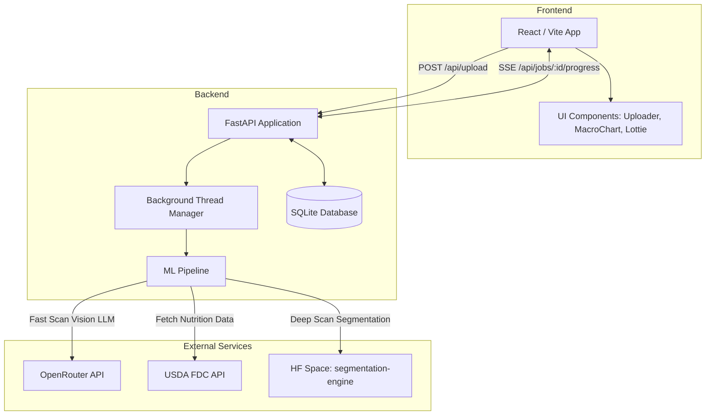

# FoodVision Architecture

## System Overview

FoodVision is a full-stack application designed for food recognition and macro estimation from images. The system consists of a Vite/React frontend and a FastAPI backend that integrates with external APIs and optionally runs deep segmentation models via Hugging Face Spaces for granular image analysis. Include asynchronous job processing with Server-Sent Events (SSE) for real-time progress tracking.

## Architecture Diagram

## Core Components

### 1. Frontend (React / Vite)
- **App.jsx**: Main React application layout orchestrating uploads, SSE progress tracking, scan mode selection, and history view.
- **ImageUploader**: Allows drag-and-drop or file selection for image inputs.
- **Animations**: Integrates Lottie animations for engaging loading states.
- Server-Sent Events (SSE) connect to `/api/jobs/{job_id}/progress` to display real-time progress bars and stage updates.

### 2. Backend (FastAPI / Python)
- **main.py**: Exposes API endpoints (`/api/upload`, `/api/jobs/{job_id}/progress`, `/api/correct`). Manages background threads for processing heavy ML tasks without blocking the main event loop.
- **pipeline.py**: Heart of the data processing logic. Coordinates calling the Vision LLM (via OpenRouter) and resolving nutritional information (via USDA API). Contains distinct flows for "Fast Scan" and "Deep Scan".
- **segment_client.py**: Interfaces with the Hugging Face Space (`project-desk/food-segmentation-engine`) via Gradio Client to perform Deep Scans. Compresses images before transit to ensure lower latency.
- **database.py**: Handles SQLite connections, caching of nutritional food macro searches, and full history CRUD.

### 3. External Integrations
- **OpenRouter API**: Used for calling large multi-modal models (like `openai/gpt-4o` or `qwen/qwen-vl-plus`) to identify food items from images or cropped segments.
- **USDA FDC API**: Queries the U.S. Department of Agriculture FoodData Central database to retrieve highly accurate, official nutritional metrics for the identified food item.
- **Hugging Face Spaces**: Deep Scan relies on a dedicated HF Space running Grounded-SAM to produce labeled bounding boxes and image cutouts for individual food items on a plate.

### 4. Data Flow
1. User uploads an image via the Frontend and selects Fast or Deep scan.
2. The Backend accepts the file, spins up a background thread, and immediately returns a `job_id`.
3. The Frontend opens an SSE connection to listen for `progress`, `result`, or `error` events.
4. The Pipeline analyzes the image (segmenting it first if Deep Scan is selected), pings OpenRouter for classification, and resolves macros via the USDA API.
5. Once complete, the Pipeline triggers a final `result` event containing parsed items, nutritional totals, and cropped image URLs, updating the Frontend UI.
